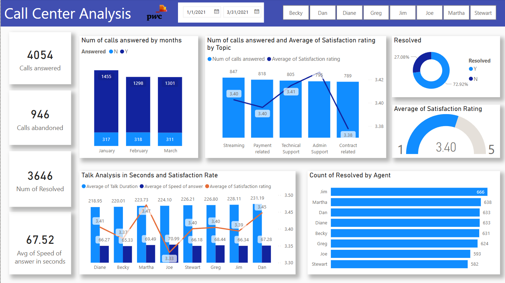
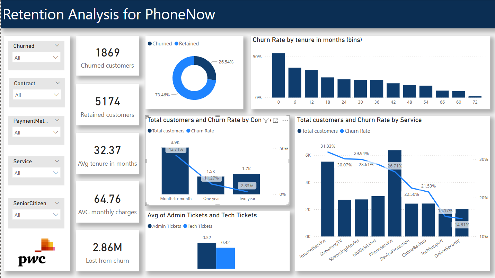
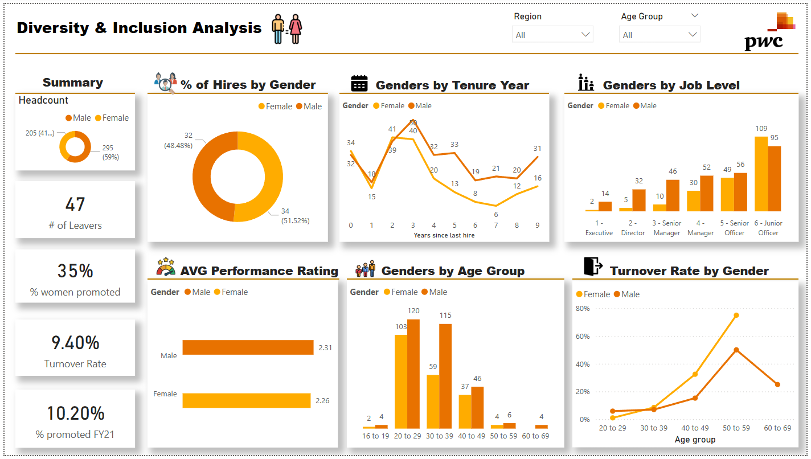

# Introduction
In today’s fast-moving digital landscape, businesses must embrace data-driven decision-making to stay competitive. **PwC’s Digital Accelerator Programme** is designed to equip professionals with cutting-edge skills in automation, machine learning, and data visualization—key components in transforming business operations. As part of this initiative, **Power BI** plays a crucial role in **turning raw data into actionable insights**, enabling companies to work smarter, faster, and more innovatively.

I recently completed a job simulation inspired by this program, where I defined key performance indicators (KPIs) and leveraged Power BI to analyze **business data across various real-world scenarios** for a telecom business. This included evaluating call center **staff performance**, analyzing **customer retention and churn**, and assessing **diversity and inclusion metrics within the HR department**. Through this experience, I had the opportunity to design dynamic dashboards, uncover meaningful insights, and translate data into actionable strategies—enhancing both business efficiency and decision-making.

# Implementation
The program consists of three tasks across different business domains, each requiring carefully tailored KPIs to extract meaningful insights. Despite completing the program within two weeks due to time constraints, I noticed **significant improvement** in the organization and clarity of my visualizations **over time**. With each task, I reflected on my approach, identified areas for enhancement, and applied those learnings—resulting in **more insightful and well-structured dashboards**.

## Task 1: Call Center Staff Performance Analysis

The above mail is sent from the Call Centre Manager at PhoneNow. You can check the dataset [here](01-Call-Center-Dataset.xlsx).

Possible KPIs include:
- Overall customer satisfaction
- Overall calls answered/abandoned
- Calls by time
- Average speed of answer
- Agent’s performance quadrant -> average handle time (talk duration) vs calls answered

Link to the dashboard: [here](Call_Center.pbix).

**Reflection After the Task**: While the dashboard effectively presents insights based on the identified KPIs, there is room for improvement in terms of organization and impact. Enhancing chart selection and clarity can make the visualizations more intuitive and actionable. Some charts currently display excessive information, leading to visual clutter and reduced readability. Moving forward, a more focused and structured approach to data visualization will help ensure that key insights are presented in a clear and compelling manner.

## Task 2: Customer Retention Analysis

This task focuses on analyzing customer retention trends and providing data-driven recommendations to improve retention strategies. You can access the dataset [here](02-Churn-Dataset.xlsx).

Link to the dashboard: [here](Retention_Analysis.pbix).

The following are several key findings that give insights into the customer retention during the given time period:

- **Overall Churn Rate**: Over the past few months, 26.5% of customers (1,869 out of 7,043) have churned.
- **Tenure Impact**: Customers with **longer tenure are less likely to churn**. The highest churn rate (54%) was observed among customers with a tenure of 0–6 months.
- **Contract Type Influence**: Month-to-month contracts had the highest churn rate (42.7%), followed by one-year and two-year contracts, aligning with the tenure trend.
- **Service Type Effect**: Customers using Streaming TV and Streaming Movies had the highest churn rates (around 30%), while those subscribed to Tech Support and Online Security services had significantly lower churn rates (around 15%).
- **Support Ticket Trends**: Retained customers predominantly submitted administrative tickets, whereas churned customers frequently reported technical issues—suggesting that **technical difficulties were a major driver of churn**.
- **Payment Method Impact**: Customers using Electronic Check had the highest churn rate (45%), significantly higher than other payment methods.
-**Demographic Factor**: Senior customers exhibited a significantly higher churn rate (41%) compared to their younger counterparts (23.6%).

**Reflection after the Task**: The dashboard this time provides a clearer, more structured narrative around customer retention trends. By reducing clutter and improving data storytelling, the insights are now more actionable and easier to interpret, helping identify key factors driving customer churn.

# Task 3: Diversity & Inclusion Analysis

This task requires analysis on diversity and inclusion for a HR department. They’ve been working hard to improve gender balance at the executive management level, but they’re not seeing any progress. You can access the dataset [here](03-Diversity-Inclusion-Dataset.xlsx).

Link to the dashboard: [here](Diversity&Inclusion.pbix). 

The following findings give insigts explaining why there is a slow progress in improving gender balance in the business:
- 